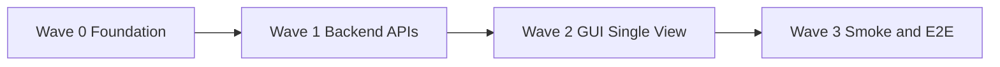

# Full Plan: Integrated Organism — Parallel Waves, TDD, Smoke, E2E

## Principles

- **Scope:** Everything in scope. No workarounds, no "later," no optional deferral. Merge, mutate (traits + creative), soup mode, all providers, single view, Strudel audio, organism run, BFF merge-in-loop — all delivered.
- **Contradictions / ambiguities:** None. Gallery = one file per version; content is either plain string (p5, backward compat) or JSON `{ type: 'organism' | 'p5', musicCode?, visualCode?, code? }`. E2E = Ollama at localhost for required real-LLM tests; cloud E2E optional (env-configured, skip when unset).
- **Parallelizability:** Work is split into waves. Within each wave, tasks with no dependency on each other run in parallel by sub-agents. Dependencies are only between waves (Wave N+1 may depend on Wave N).
- **TDD:** Every task is implemented as: (1) **Red** — write failing test(s), (2) **Green** — implement to pass, (3) **Refactor** — clean up. Sub-agents must not implement production code before the test exists.
- **Smoke:** After each wave, run a defined smoke suite (unit + integration for affected areas; no E2E until final wave). Any failure blocks the next wave.
- **E2E:** Final wave runs full E2E including real LLM (Ollama). Optional cloud E2E (env-configured) can run separately and skip when unset.

---

## Gallery and E2E Conventions (fixed)

- **Gallery organism format:** One file per version. Filename `vN.json` for organism (or keep `vN.js` and write JSON string content). Content: `{ "type": "organism", "musicCode": "...", "visualCode": "..." }` or `{ "type": "p5", "code": "..." }`. Backward compat: if file content does not parse as JSON or has no `type`, treat entire content as p5 `code` (current behavior).
- **E2E LLM:** Required E2E tests use **Ollama** at `http://localhost:11434` with a documented model (e.g. `mistral` or `codellama`). Plan assumes Ollama is running for the final E2E wave. Cloud (e.g. Inception/OpenAI) E2E remains env-based and skips when API key unset.

---

## Wave 0: Foundation (no feature dependency on other waves)

**Goal:** Gallery supports organism payloads; LLMClient supports OpenAI and Anthropic; ConfigLoader and GUI Config support new providers; deterministic generators expanded. All existing tests pass.

**Parallel tasks (each = TDD: red, green, refactor):**

| Id   | Task                                    | Test first (red)                                                                                                                                | Implement (green)                                                                                                                                              | Refactor                                                                                                                                                   |
| ---- | --------------------------------------- | ----------------------------------------------------------------------------------------------------------------------------------------------- | -------------------------------------------------------------------------------------------------------------------------------------------------------------- | ---------------------------------------------------------------------------------------------------------------------------------------------------------- |
| W0-G | Gallery organism format                 | Unit test: save iteration with `{ type, musicCode, visualCode }`; load returns organism; save plain string (or legacy vN.js) still loads as p5. | Extend [Gallery.ts](src/gallery/Gallery.ts) to accept and return organism shape; write vN as JSON when type is organism; read: parse JSON, else treat as code. | Extract helpers; keep saveIteration(project, version, code) for p5; add saveOrganism(project, version, musicCode, visualCode) or overload by payload type. |
| W0-L | LLMClient OpenAI                        | Unit test (mocked fetch): provider openai, correct URL/body/headers, response parsed to code.                                                   | Add [callOpenAI](src/llm/LLMClient.ts) and branch in generateP5Sketch/improveP5Sketch.                                                                         | Share response parsing with callInception.                                                                                                                 |
| W0-A | LLMClient Anthropic                     | Unit test (mocked fetch): provider anthropic, correct API shape, response to code.                                                              | Add callAnthropic and branch.                                                                                                                                  | Same.                                                                                                                                                      |
| W0-C | ConfigLoader + isConfigured             | Unit test: getEffectiveConfig returns openai/anthropic when set; isConfigured true for OPENAI_API_KEY or ANTHROPIC_API_KEY.                     | Extend [ConfigLoader.ts](src/config/ConfigLoader.ts) and [LLMClient.ts](src/llm/LLMClient.ts) isConfigured.                                                    | —                                                                                                                                                          |
| W0-M | generateMusic/generateVisuals expansion | Unit test: new keywords (e.g. "glitch", "reactive") produce distinct Strudel/Hydra code.                                                        | Add branches in [generateMusic.ts](src/music/generateMusic.ts) and [generateVisuals.ts](src/generateVisuals.ts).                                               | —                                                                                                                                                          |
| W0-T | Traits in generateMusicToVisual         | Unit test: generateMusicToVisual accepts traits (bpm, palette); passes to generateMusic/generateVisuals.                                        | Extend [generateMusicToVisual.ts](src/musicToVisual/generateMusicToVisual.ts) and generators to accept optional traits.                                        | —                                                                                                                                                          |

**Smoke after Wave 0:** `npm run build && npm run test -- --testPathIgnorePatterns=e2e` (unit + integration only). All must pass.

---

## Wave 1: Backend APIs and Ralph/Soup

**Goal:** Run API supports mode=organism; Merge and Approve APIs; Propose-mutate (traits + creative); RalphLoop organism mode and deterministic routing; BFF merge-every-N; Soup mode. All covered by integration tests.

**Dependencies:** Wave 0 (Gallery organism, LLMClient providers, traits).**

**Parallel tasks:**

| Id    | Task                      | Test first (red)                                                                                                                            | Implement (green)                                                                                                                                                                    | Refactor                |
| ----- | ------------------------- | ------------------------------------------------------------------------------------------------------------------------------------------- | ------------------------------------------------------------------------------------------------------------------------------------------------------------------------------------ | ----------------------- |
| W1-R  | Run API organism mode     | Integration test: POST /api/run with mode=organism, prompt, traits → 200, gallery has new project with organism iterations.                 | [gui/server.js](gui/server.js): read mode and traits; when organism, call generateMusicToVisual per iteration (or RalphLoop with organism generator); save via Gallery organism API. | Shared run loop helper. |
| W1-M  | Merge API                 | Integration test: POST /api/merge with project, dirName, versionA, versionB → 200, body has proposed musicCode/visualCode (or code for p5). | Implement merge: load two iterations, build merge prompt, call LLMClient (or deterministic fallback), return proposed; no save.                                                      | —                       |
| W1-A  | Approve API               | Integration test: POST /api/approve with project, dirName, proposed → 200, next version saved in gallery.                                   | Implement approve: append proposed as next version (organism or p5).                                                                                                                 | —                       |
| W1-PT | Propose-mutate (traits)   | Unit/integration: POST /api/propose-mutate with version, traits only (no LLM) → proposed organism with updated BPM/palette.                 | Deterministic mutate: load version, apply traits, re-run generateMusicToVisual, return proposed.                                                                                     | —                       |
| W1-PC | Propose-mutate (creative) | Integration test (mock LLM): POST with creative flag → LLM called, proposed returned.                                                       | When creative=true, call LLM with variation prompt; return proposed.                                                                                                                 | —                       |
| W1-O  | RalphLoop organism mode   | Unit test: RalphLoop with mode=organism uses generateMusicToVisual per iteration; no P5GeneratorLLM.                                        | [RalphLoop.ts](src/core/RalphLoop.ts): add mode/organism path; save organism pair via Gallery.                                                                                       | —                       |
| W1-B  | RalphLoop merge-every-N   | Unit test: with mergeEveryN=2, every 2nd iteration is a merge step (two from history, merge prompt, proposed).                              | Implement merge step in loop; optional user-approval hook (callback or flag).                                                                                                        | —                       |
| W1-S  | Soup mode (population)    | Unit test: SoupLoop or RalphLoop mode=soup maintains K candidates; step = pick two, merge (or generate), evaluate, replace one.             | New or extended loop with population array; pick-two, generate/merge, evaluate, replace logic.                                                                                       | —                       |

**Smoke after Wave 1:** `npm run build && npm run test:integration` plus manual or script: start gui server, curl POST /api/run (organism), POST /api/merge, POST /api/approve. All pass.

---

## Wave 2: GUI Single View and Strudel Audio

**Goal:** Single integrated view (one stage, timeline, controls); Strudel same-origin embed with Play button for audio; traits and run mode in UI; propose/approve for merge and mutate. No tab fragmentation.

**Dependencies:** Wave 1 (APIs exist).**

**Parallel tasks:**

| Id   | Task                       | Test first (red)                                                                                                                             | Implement (green)                                                                                                                                                        | Refactor                                                    |
| ---- | -------------------------- | -------------------------------------------------------------------------------------------------------------------------------------------- | ------------------------------------------------------------------------------------------------------------------------------------------------------------------------ | ----------------------------------------------------------- |
| W2-S | Strudel same-origin + Play | E2E or integration: load Live Music view, set code, click Play → audio context resumed / Strudel starts (or test that button calls start()). | Replace iframe with [@strudel/repl](https://www.npmjs.com/package/@strudel/repl) or equivalent in [App.jsx](gui/src/App.jsx); add Play button that starts/resumes audio. | —                                                           |
| W2-L | Single view layout         | E2E or DOM test: one stage area, one timeline, one Run control; no tabs for Create/Live Music/Live organism.                                 | Refactor [App.jsx](gui/src/App.jsx): single scrollable page with sections (controls, stage, timeline); stage shows organism (Strudel + Hydra + scroll) or p5.            | Extract Stage and Timeline components.                      |
| W2-T | Traits and run mode UI     | Test: run mode (p5                                                                                                                           | organism) and traits (BPM, palette) appear and POST in run request.                                                                                                      | Add mode selector and traits inputs; send in POST /api/run. |
| W2-P | Propose/Approve UI         | Test: timeline has "Merge with…" and "Mutate"; merge opens proposal preview; Approve sends POST /api/approve and refreshes.                  | Implement merge/mutate buttons, proposal modal/panel, Approve/Reject.                                                                                                    | —                                                           |
| W2-H | Hydra + scrolling code     | Test: organism stage shows Hydra canvas and scrolling code strip; playback works.                                                            | Wire Hydra container and scroll strip to current organism; ensure no regression.                                                                                         | —                                                           |

**Smoke after Wave 2:** `npm run build && npm run test` (unit + integration); if GUI E2E exists, run it. Start GUI manually and verify single view, Play sound, merge/approve flow.

---

## Wave 3: Smoke and Full E2E

**Goal:** Full test suite passes; E2E with real LLM (Ollama); no regressions.

**Dependencies:** Wave 0, 1, 2 complete.**

**Tasks (sequential within wave):**

| Id   | Task                  | Description                                                                                                                                                                                                                      |
| ---- | --------------------- | -------------------------------------------------------------------------------------------------------------------------------------------------------------------------------------------------------------------------------- |
| W3-S | Smoke full suite      | Run `npm run build && npm run test -- --testPathIgnorePatterns=e2e`. Fix any failure.                                                                                                                                            |
| W3-E | E2E Ollama (required) | E2E test: assume Ollama at localhost:11434 with model (e.g. mistral). Run full loop (p5), run organism loop, merge two organisms, approve. All with real LLM. Document: "Start Ollama and run `ollama pull mistral` before E2E." |
| W3-C | E2E cloud (optional)  | Existing or new E2E that uses env ATELIER_LLM_* / cloud provider; skips with clear message when unset. No failure when skipped.                                                                                                  |
| W3-G | E2E GUI critical path | E2E: load app, run organism, see stage (Strudel + Hydra), click Play (sound), open timeline, propose merge, approve.                                                                                                             |
| W3-R | Regression            | Run all tests (unit, integration, e2e). Fix regressions. Confirm coverage thresholds met.                                                                                                                                        |

**Exit criteria:** All non-skipped tests pass. E2E with Ollama passes when Ollama is running. Cloud E2E either passes or skips. No regressions in existing behavior.

---

## Dependency DAG (waves only)

Within Wave 0: W0-G, W0-L, W0-A, W0-C, W0-M, W0-T are independent (parallel). Within Wave 1: W1-R, W1-M, W1-A, W1-PT, W1-PC, W1-O, W1-B, W1-S are independent after Wave 0 (parallel). Within Wave 2: W2-S, W2-L, W2-T, W2-P, W2-H are independent after Wave 1 (parallel). Wave 3 is sequential (smoke then E2E then regression).

---

## File and Interface Checklist (no gaps)

- **Gallery:** [src/gallery/Gallery.ts](src/gallery/Gallery.ts) — save/load organism (one file per version, JSON); backward compat p5.
- **LLMClient:** [src/llm/LLMClient.ts](src/llm/LLMClient.ts) — OpenAI, Anthropic; isConfigured for all.
- **ConfigLoader:** [src/config/ConfigLoader.ts](src/config/ConfigLoader.ts) — provider map and effective config for openai, anthropic.
- **GUI Config:** Provider dropdown includes OpenAI, Anthropic, Ollama, Inception (or LM Studio).
- **Run API:** [gui/server.js](gui/server.js) — mode=organism, traits; calls RalphLoop or organism generator; saves organism.
- **Merge API:** POST /api/merge → propose only; Approve API: POST /api/approve → save.
- **Propose-mutate API:** POST /api/propose-mutate (traits deterministic; creative LLM).
- **RalphLoop:** [src/core/RalphLoop.ts](src/core/RalphLoop.ts) — organism mode, merge-every-N, deterministic routing.
- **Soup:** New or extended loop with population and pick-two/replace.
- **App.jsx:** Single view; stage (Strudel same-origin + Play, Hydra, scroll); timeline; propose/approve; traits and mode.
- **Tests:** Unit for Gallery, LLMClient, ConfigLoader, generateMusic/Visuals, RalphLoop, Soup. Integration for all new APIs. E2E: Ollama full loop + organism + merge + approve; GUI critical path; cloud optional skip.

---

## Summary

- **Wave 0:** Gallery organism format, LLMClient OpenAI+Anthropic, ConfigLoader, expanded generators, traits in generateMusicToVisual. TDD per task. Smoke: unit + integration (no e2e).
- **Wave 1:** Run organism API, Merge, Approve, Propose-mutate (traits + creative), RalphLoop organism + merge-every-N, Soup mode. TDD per task. Smoke: integration + light API curl.
- **Wave 2:** Strudel same-origin + Play, single view layout, traits/mode UI, propose/approve UI, Hydra + scroll. TDD per task. Smoke: full suite except e2e.
- **Wave 3:** Full smoke, E2E with Ollama (required), E2E cloud (optional skip), E2E GUI, regression and coverage.

No workarounds, no postponement. One gallery format (one file, JSON for organism). E2E real LLM via Ollama; cloud optional.